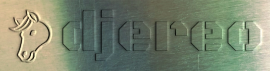

<!-- markdownlint-disable MD041 first-line-heading/first-line-h1 -->

>   
> `djereo` is a work in progress. It will not be ready to use until v1.0.0.

<!-- markdownlint-disable MD033 no-inline-html -->

  <!-- markdownlint-disable MD013 line-length -->
  
  <!-- markdownlint-enable MD013 line-length -->

`djereo` - a Django project template with opinionated tooling.

Built on top of the [pycliche](https://github.com/albertomh/pycliche) template.

## Features

Projects created using `djereo` include:

- A basic Python package and entrypoint, configured via a `pyproject.toml`.
- Dependencies managed via `uv`, using a `uv.lock` file for reproducible builds.
- IPython as the default shell.
- Simple configuration to enhance your logs with `structlog`.
- Ready-to-use dev tools: Django Debug Toolbar, `django-browser-reload`, runserver logs
  formatted using `rich`.
- Out-of-the-box code coverage reporting with `coverage.py`.
- Batteries-included `pre-commit` hook configuration to lint & format code, and run SAST.
- A `justfile` to enable using `just` as a task runner.

Optionally, for projects intended to be hosted on GitHub, also include:

- GitHub Actions to:
  - Automate cutting releases via `Release Please`.
  - Run `pre-commit` hooks and `pytest` as part of a Continuous Integration pipeline.
- A `dependabot` configuration to keep Python packages & GitHub Actions up to date.

>   
> Starting a Python project? Try [pycliche](https://github.com/albertomh/pycliche), the base
> `djereo` is built on, as your Python project template.

## Quickstart

This section covers how to create a Django project using `djereo` as a template.

### Prerequisites

The following must be available locally:

- [Python 3.10](https://docs.python.org/3.10/) or above
- [uv](https://docs.astral.sh/uv/)

### Bootstrap a new Django project

Bootstrap a new Django project using `djereo`:

1. Navigate to the directory under which you wish to create a new project.
1. Run `uvx copier copy --trust gh:albertomh/djereo <project_name>` and follow the wizard.

This creates a directory under your current location. Follow the README in the new
`<project_name>/` directory to get started with your project.

Please note:

- it is not necessary to clone `djereo`. The `gh:albertomh/djereo` argument will pull
  the latest tag from GitHub.
- the `--trust` flag is necessary to allow a post-creation task to initialise the new directory
  as a git repository and generate a `uv` lockfile.

---

## Documentation

`djereo`'s documentation is available at [https://albertomh.github.io/djereo/](https://albertomh.github.io/djereo/).

---

## Develop

The developer documentation ([https://albertomh.github.io/djereo/develop/](https://albertomh.github.io/djereo/develop/))
covers how to work on `djereo` itself:

- [Develop](https://albertomh.github.io/djereo/develop/#develop)
  - Development prerequisites
  - Upgrading the pycliche version
  - Git principles
  - Dependency management
    - Updating dependencies in the template
  - Generate project using development version
  - Style
  - Upgrade checklist

- [Test](https://albertomh.github.io/djereo/develop/#test)

- [Document](https://albertomh.github.io/djereo/develop/#document)

- [Release](https://albertomh.github.io/djereo/develop/#release)
  - GitHub Personal Access Token

---

## Acknowledgements

Several tooling choices have been guided by the work of [Adam Johnson](https://adamj.eu/tech/).

The `djereo` logo is typeset in [Black Ops One](https://fonts.google.com/specimen/Black+Ops+One).

## What's in a name?

"Stereotype" or "stereo" refers to the metal plates used to quickly mass-produce printed media.
