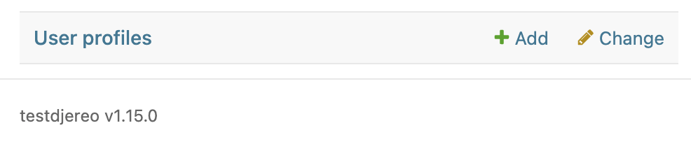
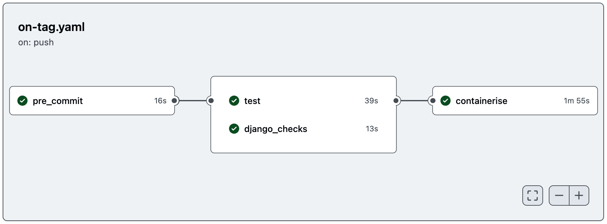
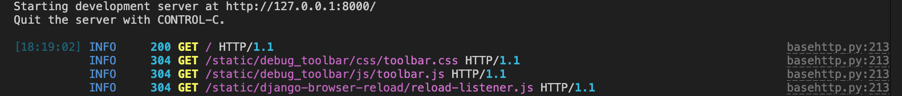

<!-- markdownlint-disable MD033 no-inline-html -->
# Djereo's features

`djereo` is a Django project template with opinionated tooling.

When invoked by following the instructions in the [Quickstart](./quickstart.md) the user
is prompted to answer questions and make choices via a CLI. These answers are used to
create a ready-to-use opinionated Django project.

This page documents the features of a Django project as generated by `djereo`.

## ☑️ Setup questionnaire

[copier.yaml](https://github.com/albertomh/djereo/blob/main/copier.yaml){target=\"_blank"}
defines the questionnaire that `copier` will use to prompt the user when setting up a new
project. The questions defined in this file include sensible defaults (where appropriate)
and validation rules to prevent incoherent answers.

!!! note "Options? - I thought this was an opinionated template!"
    `djereo` is opinionated insofar as it embodies beliefs such as 'postgres is the best
    database for a new project' or 'htmx for frontends is great'. It lays out paved paths
    and sensible defaults if you choose to configure a new project with these tools. The
    aim is not to be restrictive or force e.g. `htmx` or `django-waffle` on anyone.

### Versions

Users are asked three version-related questions when initialising a project:

#### Django version

[Django](https://docs.djangoproject.com/en/stable/){target=\"_blank"} is a popular web
framework written in Python. `djereo` gives you the choice between creating projects using
Django versions:

- 5.2 (latest)
- 5.1
- 4.2 (LTS, long-term support version)

See [https://endoflife.date/django](https://endoflife.date/django){target=\"_blank"} for
more information.

#### Python version

`djereo` (and its base, [pycliche](https://github.com/albertomh/pycliche){target=\"_blank"})
support Python 3.13 and above. The user's choice is recorded in a [.python-version](https://github.com/albertomh/djereo/blob/main/template/.python-version.jinja){target=\"_blank"}
file and in the `requires-python` field of [pyproject.toml](https://github.com/albertomh/djereo/blob/main/template/pyproject.toml.jinja){target=\"_blank"}.

See [https://endoflife.date/python](https://endoflife.date/python){target=\"_blank"} for
more information.

#### Postgres version

`djereo` is configured to work with a postgres database and contains utilities and checks
to help with this. See [Postgres database](#postgres-database) below for more information.

Note that it is trivial to switch from postgres to SQLite (a single-line change in `.env.in`)
if you prefer that database engine.

!!! note "Keeping versions consistent"
    The `django-version-checks` package is used to ensure all environments (local, CI, dev,
    prod) use the same versions of Python & postgres.

## 🚦 Semantic Versioning

The generated project follows Semantic Versioning, with users prompted to provide an
initial version at project setup. The project's version is tracked in the `version` field
of [pyproject.toml](https://github.com/albertomh/djereo/blob/main/template/pyproject.toml.jinja){target=\"_blank"}.

See [Release Please](#release-please) below for information on how this version can be used
alongside Conventional Commits to automatically generate changelogs and new semver tags.

See [https://semver.org/](https://semver.org/){target=\"_blank"} for more information.

<!-- markdownlint-disable MD046 code-block-style [false positive] -->
!!! note "Checking the app's version"
    `djereo`'s base template &amp; its override of Django Admin's base template both
    include a footer showing the deployed tag:

    
<!-- markdownlint-enable MD046 code-block-style -->

## 🪝 Git pre-commit hooks

Every new project comes with a set of sensible [pre-commit](https://pre-commit.com/){target=\"_blank"}
git hooks. These are defined in [.pre-commit-config.yaml](https://github.com/albertomh/djereo/blob/main/template/.pre-commit-config.yaml.jinja){target=\"_blank"}
and include:

- Common core hooks such as `check-merge-conflict` or `end-of-file-fixer`.
- `mypy` to perform static type checks on Python code.
- `asottile/pyupgrade` to convert syntax when the version of Python is upgraded.
- `astral-sh/ruff-pre-commit` to lint & format Python code at lightspeed with Ruff. Check
  the `tool.ruff.lint` table in `pyproject.toml` for a full list of rules and options.
- `DavidAnson/markdownlint-cli2` to lint markdown files with rules configured in [.markdownlint-cli2.yaml](https://github.com/albertomh/djereo/blob/main/template/.markdownlint-cli2.yaml){target=\"_blank"}.
- `biomejs/pre-commit` to lint & format frontend code (JS, TS, CSS) following config in [biome.jsonc](https://github.com/albertomh/djereo/blob/main/template/biome.jsonc){target=\"_blank"}.
- `adamchainz/djade-pre-commit` to format Django templates.
- `adamchainz/django-upgrade` to automatically migrate code to a new version of Django.
- `alessandrojcm/commitlint-pre-commit-hook` to enforce [Conventional Commits](https://www.conventionalcommits.org/en/v1.0.0/){target=\"_blank"}.

<!-- markdownlint-disable MD013 line-length -->
##  Optional GitHub features
<!-- markdownlint-enable MD013 line-length -->

As part of the setup questionnaire users are asked whether the project they are creating
will be hosted on GitHub. If this is the case, GitHub Actions config files are added to
their project. The resulting custom actions and workflows are described below.

### Custom GitHub actions

Four reusable custom actions are available:

- `pre-commit`: runs all pre-commit hooks except `no-commit-to-branch` as this would
   make merge pipelines fail. In workflows (see below) all jobs depend on this action
   succeeding.
- `django-checks`: runs Django's system checks (`manage.py check`). Optionally with the `--deploy`
  flag set. This check is strict by default, failing on warnings. Add checks to `SILENCED_SYSTEM_CHECKS`
  in `settings.py` to ignore specific warnings.  
  **N.B.** For system checks to succeed in 'deploy' mode, a GitHub Actions 'repository secret'
  called `DJANGO_SECRET_KEY` must exist in GitHub (under <repo>/secrets/actions).
  The contents of this secret must be a random string at least 50 characters long.

- `containerise`: builds a container image and pushes it to the specified registry. Accepts
  a list of platforms to build for, a list of tags and the path to a Dockerfile.  
  **N.B.** If wishing to use the GitHub Container Registry (ghcr.io, the default) make sure
  you follow the click-ops steps detailed in `.github/actions/containerise/action.yaml`.
- `service-health`: calls the liveness & health endpoints (see [Healthchecks](#healthchecks)
  below), allowing you to check the status of a service after a deployment.

See [.github/actions/](https://github.com/albertomh/djereo/tree/main/template/%7B%25if%20is_github_project%25%7D.github%7B%25endif%25%7D/actions){target=\"_blank"}
for the definitions of these actions.

### GitHub Actions workflows

Four workflows are defined:

#### `PR` (pull request)

Runs whenever a pull request is opened against a branch or an existing PR receives new commits.

#### `CI` (continuous integration)

As with `PR`, but acts when a pull request is closed and changes merged into the `main` branch.

#### Release Please

Refreshes a pull request that updates the changelog & bumps the Semantic Version every
time the `main` branch is merged to.  
[.release-please-config.json](https://github.com/albertomh/djereo/blob/main/template/%7B%25if%20is_github_project%25%7D.release-please-config.json%7B%25endif%25%7D.jinja){target=\"_blank"}
configures the tool while [.release-please-manifest.json](https://github.com/albertomh/djereo/blob/main/template/%7B%25if%20is_github_project%25%7D.release-please-manifest.json%7B%25endif%25%7D.jinja){target=\"_blank"}
is the source of truth for the latest SemVer tag.

**N.B.** conventional commits (as enforced by the relevant git hook) are a prerequisite
for Release Please to generate changelogs and calculate new SemVer tags.

In order for Release Please to automate the above process, a GitHub Actions 'repository secret'
called `RELEASE_PLEASE_TOKEN` must exist in GitHub (under <repo>/secrets/actions).
The contents of this secret must be a Personal Access Token (PAT) with the following permissions:

```yaml
contents: write
pull-requests: write
```

For more information, consult the [release-please-action project](https://github.com/googleapis/release-please-action){target=\"_blank"}.

#### On tag

Runs whenever a tag matching the pattern `vM.m.p` is pushed to GitHub (where `M.m.p` is a
SemVer tag, see [Semantic Versioning](#-semantic-versioning) above).

This is intended as the foundation providing 80% of your deployment pipeline. Out of the
box the `on-tag` workflow runs the following jobs:



This can be extended to end with the 'service-health' job (see [Custom GitHub actions](#custom-github-actions)
above). This is not shown in the above workflow since `djereo` does not implement a 'deploy'
job that would be necessary to bridge 'containerise' and 'service-health'.

#### Dependabot

Configured to update Python dependencies & GitHub actions on a weekly schedule.

See [.github/workflows/](https://github.com/albertomh/djereo/tree/main/template/%7B%25if%20is_github_project%25%7D.github%7B%25endif%25%7D/workflows){target=\"_blank"}
and [.github/dependabot.yaml](https://github.com/albertomh/djereo/blob/main/template/%7B%25if%20is_github_project%25%7D.github%7B%25endif%25%7D/dependabot.yaml){target=\"_blank"}
for the definitions of these workflows.

## 🤖 Justfile

Four recipes are ready to use in every new project. Each takes care of setting up a
virtualenv and installing dependencies (including the project itself in editable mode).

- `manage`: wrapper around Django's `manage.py`. Takes one or more arguments, which
  defaults to 'help'.
- `runserver`: execute Django's `runserver` management command using Python in
  [Development Mode](https://docs.python.org/3/library/devmode.html){target=\"_blank"}.
  This mode shows additional warnings (Deprecation, Import, Resource) and enables extra
  debug hooks. Development Mode can be disabled by passing an empty string
  i.e. `just runserver 127.0.0.1:8000 ""` (the `portaddr` must be set when disabling Dev
  Mode as these are positional arguments).
- `shell`: run Django's management command to drop into a shell. By default this is IPython
  in all new projects.
- `test`: install test dependencies, run all unit tests via Django's test runner and
  generate and display a coverage report (both on-screen and in HTML format).

## 💻 Developer Experience enhancements

### Use IPython as your shell

`IPython`, an improved Python shell, is installed as a development dependency. Django picks
it up by default and uses it instead of the default Python shell. Access it directly with
the `just shell` recipe.

By default IPython's debugger (`ipdb`) will launch when a `breakpoint()` is reached while
running the application.
`ipdb` is also used to debug tests and will launch when a test fails. The file `.pdbrc`
contains aliases that can be used in `ipdb` debugger sessions.

### Developer tools

The project comes with some ready-to-use developer tools installed as dev dependencies and
configured for use locally:

- [django-browser-reload](https://pypi.org/project/django-browser-reload/){target=\"_blank"}:
  watch project files for changes and reload the browser.
- [django-debug-toolbar](https://pypi.org/project/django-debug-toolbar/){target=\"_blank"}:
  display information about the request/response cycle on each page.
- [rich](https://pypi.org/project/rich/){target=\"_blank"}: nicer formatting and colours
  for `runserver` logs.

### Custom system checks

`djereo` adds two custom system checks that run when the `check` management command is
invoked.

- `check_dev_mode`: alerts to the application running in debug mode yet Python's Development
  Mode not being enabled, indicating that there are some warnings and debug hooks you may
  be missing out on.
- `check_model_names`: enforces consistent model names across the application.

The `django-checks` GitHub action will run the default Django checks and the above custom
checks as part of the continuous integration pipeline.

While strictly speaking not a system test, the `django-linear-migrations` package is enabled
on all projects generated by `djereo`. This package updates a `max_migration.txt` file
whenever `makemigrations` runs, triggering a merge conflict if there is an attempt to apply
a non-linear migration history.

### Use project metadata in the Django app

`{{project_name}}/__init__.py` exposes project metadata such as version and author information.
To use it in a view:

```python
from django.http import HttpResponse

from {{project_name}} import __version__


def view(request):
    return HttpResponse(f"on version v{__version__}")
```

The custom `context_processors.metadata` processor also exposes the version for use in
templates.

## ⚙️ settings.py

`settings.py` takes values for certain configuration options from environment variables,
managed via the `environs` package. When no values are specified, it falls back to sensible
defaults.

`settings.py` is divided into five sections:

- **Setup**  
  Settings such as determining whether the application is running under test conditions or
  defining the `BASE_DIR`.
- **Django Core Settings**  
  `INSTALLED_APPS` is defined by combining three lists containing apps according to their
  provenance. `LOGGING` is configured to use `rich` when DEBUG is True and `structlog`
  otherwise.
- **Django Contrib Settings**  
  [_left empty for the user to populate_]
- **Third Party Settings**  
  Settings for `django-allauth` and dev tools such as the debug toolbar and `django-version-checks`.
- **Project Settings**  
  [_left empty for the user to populate_]

The `tool.ruff.lint.flake8-tidy-imports.banned-api` table in `pyproject.toml` includes
configuration to have the `ruff` pre-commit hook enforce a ban on importing the `settings`
module directly. It suggests that you use `from django.conf import settings` instead as
this is safer and avoids complications if `override_settings` is used in tests.

## 🪵 Logging

Logging differs between hosted environments (eg. production) and development.

In development (`runserver`) [rich](https://pypi.org/project/rich/){target=\"_blank"} is
used to output colourful logs:



When `DEBUG=False`, as in production, [structlog](https://www.structlog.org/){target=\"_blank"}
is used instead.

Logging configuration is dynamically generated based on the `DEBUG` environment variable.
The `LoggingConfigFactory` class is used to generate settings for filters, formatters,
handlers and loggers.

## 📨 Local SMTP server (Mailpit)

Development entrypoints (justfile recipes, e2e tests) assume that [Mailpit](https://mailpit.axllent.org/docs/){target=\"_blank"}
is installed and available locally. This is a simple SMTP server that will run alongside
your application locally to aid development. It can be accessed at <http://127.0.0.1:8025>.

## Models

The core app defines an `UuidModel` abstract model. Models that subclass it will have
a UUID as a primary key instead of the default `BigAutoField`. This is used by the models
in the existing 'users' app and can be used by any new models you create.

Utility abstract models `CreatedAtModel`, `UpdatedAtModel` and `DeletedAtModel` (for
soft-deletion) are available to store timestamps.

## 🐘 Postgres database {#postgres-database}

`djereo` projects are configured to use a `postgres` database out-of-the-box.

This can easily be switched to use a SQLite database instead by changing a single line in
the dotenv template, `.env.in`.

### Set up & tear down scripts

The `_db/` directory contains the following database scripts:

- `set_up.sql` creates a postgres user and database with the same name as the project.
- `tear_down.sql` undoes `set_up.sql` and removes the database and user.

Django's default test database behaviour (creating a new database with a name formed by
prepending the name of the default database with `test_`) is left as-is.

### Database connection string

The database connection is configured in `settings.py` using the `environs` package's
'Django database URL' extension. That is, as a single database connection string that is
located in `.env` as the environment variable `DATABASE_URL`.

### Connection pooling

Djereo takes advantage of Django's built-in support for postgres connection pooling ([Django docs](https://docs.djangoproject.com/en/stable/ref/databases/#connection-pool){target=\"_blank"}).
While this is a premature optimisation for most projects, the overhead of opening a new
postgres connection is considerable, so connection pooling is enabled to alleviate this.

### `seed_database` management command

A `seed_database` management command is included for quickstart purposes and as a starting
point for you to populate with models needed for local development as your application grows.

In a new project `seed_database` creates three users: admin, staff and a non-privileged
regular user.

Invoke it with `just manage seed_database`.

## 🗄️ Cache

New projects' cache configuration aims for simplicity and speed when developing & running
tests. You should probably switch to a dedicated cache server in production.

For local development (ie. when `DEBUG=True`) or when running tests, Django's `DummyCache`
is used. This is a transparent cache that implements the cache interface without actually
storing any responses.

Out of the box, `djereo` projects will use `LocMemCache`, which is Django's default if a
cache is not specified.

A `CACHE_COMMON_CONFIG` is defined, which should be used by all caches, even new ones you
define. This defines a `KEY_PREFIX` used to namespace values. The `KEY_PREFIX` makes
reference to the Python version used to generate the key. This is a safeguard against the
case where breaking changes to `pickle` across different Python versions render a value
cached using a previous version unreadable by a newer one.

## 🆔 User authentication

Projects generated with `djereo` follow the 'custom User + UserProfile' pattern common in
modern Django apps. Authentication functionality is implemented via the [django-allauth](https://allauth.org/){target=\"_blank"}
package for simplicity and to ease future extensibility. A dedicated Django app, `users`,
centralises models, template overrides and configuration for auth-related features.

### `users` app model factories

Model factories for `AuthUser` and `UserProfile` are provided as a convenience. This includes
subfactories to keep tests lean. This means that in a test one may generate a fleshed-out
user with:

```python
from users.factories import UserProfileFactory  
from users.models import AuthUser

profile = UserProfileFactory()

assert isinstance(profile.user, AuthUser)
```

<!-- markdownlint-disable MD013 line-length -->
##  Frontend
<!-- markdownlint-enable MD013 line-length -->

### Default pages & styling

Generated projects include a vendorised copy of [mvp.css](https://andybrewer.github.io/mvp/){target=\"_blank"}.
This is used to style the default welcome page and the templates used by `django-allauth`
for the pages under `/accounts/`.

#### Styling `django-allauth` templates

See the section on [Styling Existing Templates](https://docs.allauth.org/en/latest/common/templates.html#styling-the-existing-templates){target=\"_blank"}
in the `django-allauth` docs for instructions on doing so. Out of the box `djereo` keeps
changes minimal, only overriding `django-allauth`'s base template (`users/templates/allauth/layouts/base.html`).

### Optional `htmx` frontend

Projects generated using `djereo` include a vendorised copy of `htmx` that is loaded in
the `_base.html` template via `django-htmx`'s `` tag. You can opt out
from this when completing the setup questionnaire.

The `django-htmx` package is used to smoothly integrate `htmx` into projects, abstracting
away header checks and allowing views to change their behaviour and responses based on the
`request.htmx` attribute.

See the [django-htmx documentation](https://django-htmx.readthedocs.io/en/latest/index.html)
for more.

## 🤝 Third-party packages

### whitenoise

[whitenoise](https://whitenoise.readthedocs.io/en/stable/){target=\"_blank"} is included
as a dependency. It is configured to serve static files using Brotli compression and add
unique hashes to filenames so that each version can be cached for a long time.

## 🔒 Security

`settings.py` is configured to detect whether the application is running in a hosted
environment and enable security enhancements. A hosted environment is detected by checking
that `DEBUG` is False and that localhost is not amongst the `CSRF_TRUSTED_ORIGINS`.

- Strict-Transport-Security: this header is enabled via the `SECURE_HSTS_*` settings.
  Configured for a duration of 3600 seconds to begin with, it is recommended this is
  increased to 2,592,000 seconds (30 days).
- Content-Security-Policy: Django's [built-in support for CSP](https://docs.djangoproject.com/en/stable/topics/security/#security-csp){target=\"_blank"}
  is used to set this header to a locked-down default.
- `SECURE_SSL_REDIRECT` is not set explicitly under the assumption that the application
  will sit behind a reverse proxy that will take care of redirecting HTTP to HTTPS.
  `SECURE_PROXY_SSL_HEADER` is also configured to ease this.
- [django-permissions-policy](https://pypi.org/project/django-permissions-policy/){target=\"_blank"}
  is used to apply sensible restrictions to block annoying & intrusive web APIs. See the
  `PERMISSIONS_POLICY` setting for details.
- Cross-Origin-Opener-Policy: by default Django sets this to the secure `same-origin` value.
- Cross-Origin-Embedder-Policy & Cross-Origin-Resource-Policy: these are set to their most
  secure values by means of a custom middleware, `SecurityHeadersMiddleware`. There is an
  open ticket to add these to Django ([#31923](https://code.djangoproject.com/ticket/31923){target=\"_blank"}).

## 🧪 Tests

`djereo` projects come with all the tooling needed to get you writing tests quickly, as
well as a couple of tests ready out-of-the-box.

To run these tests call `nox`, passing the same optional arguments you would when using
`manage.py test` e.g. `nox -- package.module` or `nox -- --pdb`.

Nox is used to automate testing across different Python versions. Test sessions are
configured via `noxfile.py`. `coverage` reporting will only run for test runs for the
oldest and latest Python versions.  
By default calling `nox` will only run the session for the latest supported Python release.

The `PendingMigrationsTests` class will fail if any model changes are not yet captured in
a migration, with the aim of negating the possibility of a deployment attempt that fails
due to missing migrations.

The `test_checks` module tests the custom Django system checks added by `djereo`.

### The custom TestRunner

Djereo provides a custom `TestRunner` that subclasses Django's `DiscoverRunner`.
This custom runner provides:

- a `TEST_SETTINGS` dictionary with which to override settings
- an `ACTIVE_RESPONSES` list with which to mock responses from third-party services
- functionality to skip slow tests when running locally

Naturally, it can be extended to serve the needs of your test suite.

#### Override settings with `TEST_SETTINGS`

`TEST_SETTINGS` is a dictionary defined in the `test` module and used by `TestRunner` to
override settings for all tests. This is the source of truth for app settings during tests
and by default sets `"DEBUG": False`.

#### Mock out requests with `ACTIVE_RESPONSES`

The custom `TestRunner` uses the [responses](https://github.com/getsentry/responses){target=\"_blank"}
package to enable you to mock responses from external services in tests.

Mock responses by modifying `ACTIVE_RESPONSES` in the test class or function:

```python
from testdjereo.test import ACTIVE_RESPONSES

class ViewTests(SimpleTestCase):
    def test_view(self):
        ACTIVE_RESPONSES.add(
            responses.GET,
            "https://example.com/api/resource",
            json={"key": "value"},
        )
        ...
```

<!-- markdownlint-disable MD013 line-length -->
If a test exercises a path that calls out to an external service (by using the `requests`
library) and this request is not mocked out, `responses` will step in and the test will
fail with the error `requests.exceptions.ConnectionError: Connection refused by Responses - the call doesn't match any registered mock`.
<!-- markdownlint-enable MD013 line-length -->

#### Skip slow tests locally

`TestRunner` will check whether tests are being run from a CI pipeline. If no environment
variable denoting a CI context is found (eg. when running locally), the runner will skip
any tests tagged 'slow' such as in the below example:

```python
from django.test import TestCase, tag

class AppTests(TestCase):
    @tag("slow")
    def test_all_the_things(self):
        ...
```

### Profile tests

Invoke `just profile_tests` to output a [speedscope](https://www.speedscope.app/){target=\"_blank"}-compatible
profile file to understand bottlenecks in your tests.
**N.B.** this requires `py-spy` to be available globally on your system.

### End-to-end (e2e) tests

A suite of end-to-end tests written using the Playwright framework lives under `tests_e2e/`.
Invoke `just e2e` to run these locally. This runs Django's `runserver` command in the
background before launching the e2e suite.

### Tests in GitHub Actions

The `test` job in GitHub Actions uses the matrix strategy. This runs each Nox session
(i.e. Python version test run) as a separate pipeline job.

A release candidate will be containerised when a Pull Request is merged. The relevant
pipeline will run the end-to-end (e2e) test suite against this candidate container image.

## 🚀 Deployment

While `djereo` eschews Docker throughout development, the advantages of containerisation
for tagged, reproducible builds in hosted environments are evident.

The `_deploy/` directory of projects generated with `djereo` includes a Dockerfile that
uses the local development toolchain (the `uv` project manager) to containerise web
applications.

The Dockerfile runs pre-production steps, such as enabling bytecode compilation to trade a longer
installation time for faster start-up times, or running Django's `collectstatic` command.
The container's entrypoint runs [gunicorn](https://docs.gunicorn.org/en/latest/index.html){target=\"_blank"}
as the WSGI web server to make the Django application available.

The resulting container has been tested in production behind [nginx](https://nginx.org/en/docs/index.html){target=\"_blank"}
as the reverse proxy, with `gunicorn` as the WSGI web server. `nginx` configuration and
setting up SSL certificates is beyond the scope of `djereo`, but hopefully the Docker image
provides a head-start on deploying applications generated by `djereo`.

`gunicorn` is included as a dependency of all `djereo` projects. If you are interested in
using ASGI instead of WSGI, check out [uvicorn](https://www.uvicorn.org/).

### Healthchecks

Generated projects pull in [django-alive](https://github.com/lincolnloop/django-alive){target=\"_blank"}
to expose two endpoints with which to monitor the health of an application instance:

- `/-/alive/`
- `/-/health/`

### Continuous Deployment

`djereo` aims to provide a foundation on which to build your continuous deployment pipeline.
Given the diversity of hosting &amp; deployment solutions it does not attempt to provide a
solution for the step that deploys your application. However, you can extend the `on-tag`
GitHub Actions workflow, which contains the following sequence of jobs:

- `pre-commit`: run all pre-commit hooks.
- `test`: run Django unit tests.
- `django_checks`: run the `check` management command with the `--deploy` flag.
- `containerise`: build an image containing your application and push to GitHub Container Registry.

(see [Custom GitHub actions](#custom-github-actions) above for more).

You can easily add a custom GitHub Action to deploy your code after this last step.
Finally, round off this pipeline with the pre-configured `service-health` action to confirm
that your app deployment worked.
